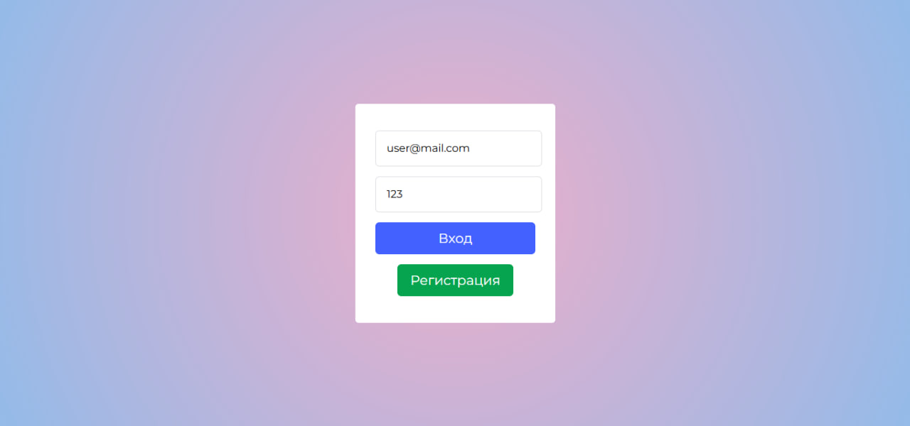
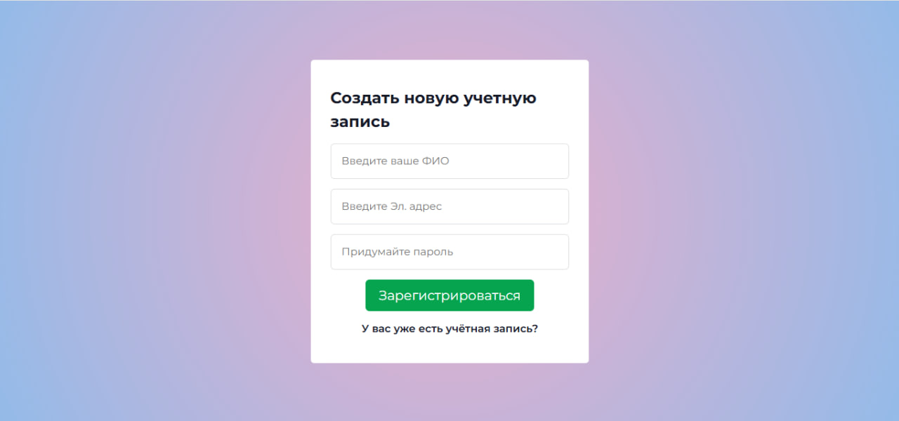
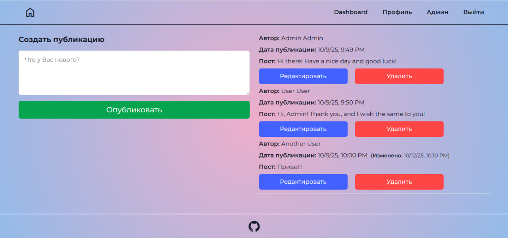
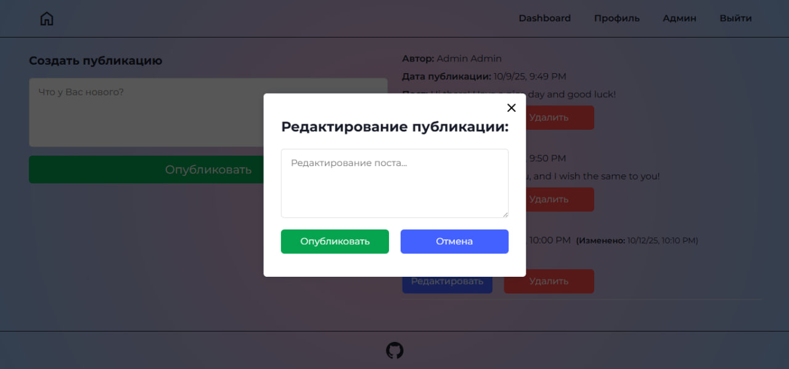
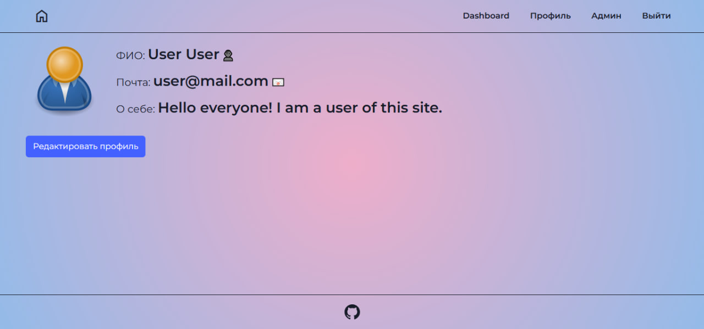
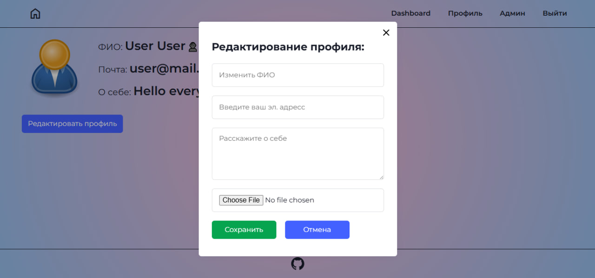

# Mini Dashboard

Небольшое модульное Angular-приложение, разработанное для практики **модульного подхода**, **TypeScript**, **Angular Routing**, **Guards**, **Interceptors** и **CRUD**-операций и **REST-запросов**.
В проекте реализовано взаимодействие с локальными данными (`db.json`) и использованы современные подходы оптимизации, такие как **Lazy Loading**.

## Ссылка на проект: https://ulzirok.github.io/angular-mini-dashboard/auth/login

---

## Функционал

- Авторизация и регистрация пользователя (данные сохраняются в `db.json` и `localStorage`);
- Профиль пользователя (редактирование данных пользователя);
- Dashboard со списком постов (редактирование постов);
- CRUD-функционал: получение, добавление, редактирование и удаление записей;
- Разделение кода по модулям и компонентам;
- Реализована маршрутизация (Routing) между страницами;
- Lazy Loading модулей для оптимизации загрузки приложения;
- Guard для защиты маршрутов (доступ только авторизованным пользователям);
- HTTP Interceptor для автоматического добавления токена к запросам;
- Адаптивный интерфейс.

---

## Технологии

- **Angular 18+**
- **TypeScript**
- **HTML / SCSS**
- **JSON Server (имитация backend)**
- **ESLint + Prettier**

---

## 📸 Скриншоты проекта

### Страница входа


### Страница регистрации


### Страница для публикации поста


### Страница для редактирования поста


### Страница профиля


### Страница для редактирования профиля



## Заметки:

Проект завершён как учебный, но готов к дальнейшему расширению (Admin page).

## Установка и запуск

```bash
# Клонировать репозиторий
git clone https://github.com/ulzirok/angular-mini-dashboard.git

# Перейти в папку проекта
cd angular-mini-dashboard

# Установить зависимости
npm install

# Запустить Angular-приложение
ng serve

# Запустить JSON Server
npx json-server --watch db.json --port 3000

```
